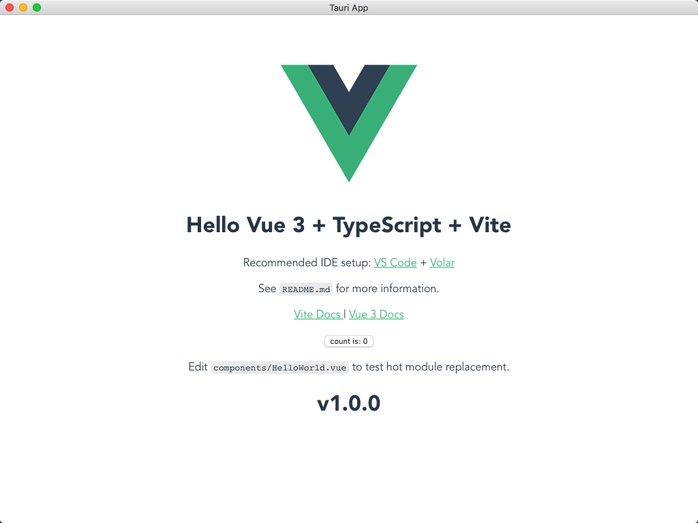

# tauri-app

tauri app demo

# Prerequisites

[Setting Up Tauri](https://tauri.app/v1/guides/getting-started/prerequisites)

# Environment

Node.js >= 14.19.0

# Development

1. Install the required shims of [Corepack](https://github.com/nodejs/corepack)

```bash
corepack enable
```

2. Install dependencies

```bash
yarn install
```

3. Run

```bash
yarn tauri:dev
```

# Building

- Test

```bash
yarn tauri:test
```

- Production

```bash
yarn tauri:prod
```

# Screenshot


